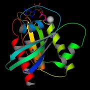
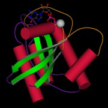
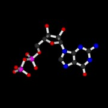

MolScriptSVG 2.1.4
==================

    Copyright (C) 1997-1998 Per J. Kraulis
    Copyright (C) 2026 James W. Murray

<table>
  <tr>
    <td>
      
    </td>
    <td>
      
    </td>
    <td>
      
    </td>
  </tr>
</table>

MolScriptSVG is a fork of MolScript, a program for displaying
molecular 3D structures, such as proteins, in both schematic and
detailed representations. As far as I can tell, MolScript is still the
only program that can produce high quality protein cartoon diagrams in
vector format. This fork extends the output modes of the original
MolScript and fixes OpenGL support.

This fork also includes SVG, MetaPost, X3D and WebGL-oriented output
backends. SVG and MetaPost are written directly from the MolScript
geometry pipeline and do not require any external library at export
time. X3D output is available as both XML (`-x3d`) and Classic
encoding (`-x3dv`). Both Classic and XML X3D are generated natively
inside MolScriptSVG. The `-webgl` mode writes an HTML viewer that
embeds the native XML X3D scene and displays it in the browser using
the X_ITE WebGL runtime.

Notes on syntax coverage and known grammar/doc mismatches are collected in
[UNDOCUMENTED_FEATURES.md](UNDOCUMENTED_FEATURES.md).

Fork-specific modifications in this repository are copyright
James W. Murray. Those modifications were developed with assistance
from OpenAI Codex.

The original documentation is at [http://pekrau.github.io/MolScript/](http://pekrau.github.io/MolScript/).


Open Source
-----------

MolScriptSVG is distributed as a fork under the MIT license in this GitHub
repository. The original MolScript project is available at [MolScript](https://github.com/pekrau/MolScript)

Version MolScriptSVG 2.1.4
-------------

The first version of MolScript (written in Fortran 77) was released in
1991, and its current version (2.1.2, written in C) in 1998.

This fork keeps the upstream MolScript 2.1.2 language and executable name,
but it is no longer a pristine 1998 code snapshot. The original OpenGL/image
build expected a 1990s GLUT/GLX setup and no longer built cleanly on a modern
Linux system. The `code/Makefile.complete` file has now been modernized to use
`pkg-config` for OpenGL, PNG, JPEG and GIF dependencies.

Build
-----

The default build path is now:

```bash
cd code
make
```

`code/Makefile` delegates to `Makefile.complete`, so plain `make` builds the
full MolScriptSVG binary by default.

### Makefile summary

- `Makefile`
  - Default entry point.
  - Produces the full build by including `Makefile.complete`.

- `Makefile.complete`
  - Modern Linux-oriented build using `pkg-config`.
  - Enables OpenGL, EGL-backed image rendering, and PNG/JPEG/GIF support by default.

- `Makefile.basic`
  - Minimal build with no OpenGL or OpenGL-backed raster image outputs.
  - Still includes PostScript, SVG, Raster3D, VRML, X3D and WebGL export code.

To build the minimal version explicitly:

```bash
cd code
make -f Makefile.basic
```

To rebuild the full version explicitly:

```bash
cd code
make -f Makefile.complete clean all
```

### Full-build dependencies

On a modern Linux system, the default full build expects `pkg-config` plus
development packages for:

- OpenGL / GLU / GLUT / X11
- EGL
- libpng
- libjpeg
- libgd
- zlib

If those are present, `make` should produce:

- `molscript`
- `molauto`

with support for:

- `-ps`
- `-svg`
- `-mp`
- `-r3d`
- `-wrl`
- `-x3d`
- `-x3dv`
- `-webgl`
- `-gl`
- `-eps`
- `-epsbw`
- `-sgi`
- `-jpeg`
- `-png`
- `-gif`

### Headless image rendering

The image-output path prefers a headless EGL OpenGL context. That avoids
opening an X11 window and allows `-png`, `-jpeg` and `-gif` rendering without
a working X11 display. If EGL initialization fails, MolScriptSVG falls back to
the hidden GLUT window path for compatibility.

### Example commands

Build:

```bash
cd code
make
```

Run:

```bash
./molscript -svg -in examples/ras_std.in -out ras_std.svg
./molscript -mp -in examples/ras_std.in -out ras_std.mp
./molscript -x3d -in examples/ras_std.in -out ras_std.x3d
./molscript -x3dv -in examples/ras_std.in -out ras_std.x3dv
./molscript -webgl -in examples/ras_std.in -out ras_std.webgl.html
```

The SVG, MetaPost, X3D and WebGL backends are available in both the basic and complete
builds:

```bash
./molscript -svg -in examples/ras_std.in -out ras_std.svg
./molscript -mp -in examples/ras_std.in -out ras_std.mp
./molscript -x3d -in examples/ras_std.in -out ras_std.x3d
./molscript -x3dv -in examples/ras_std.in -out ras_std.x3dv
./molscript -webgl -in examples/ras_std.in -out ras_std.webgl.html
```

`molauto` has also been extended with a few modern convenience options:

- `-window n`
- `-rotate a11 a12 a13 a21 a22 a23 a31 a32 a33`
- `-translate x y z`
- `-ss_palette`
- `-colourblind`
- `-publication`

The `-colourblind` preset uses a fixed high-contrast secondary-structure
palette:

- helices: orange
- strands: blue
- coils: green
- turns: yellow-orange

`-x3dv`, `-x3d` and `-webgl` are all generated natively by MolScriptSVG.
The `-webgl` output is a self-contained HTML wrapper around the native XML X3D
scene, but it still loads the X_ITE JavaScript runtime from a CDN at view time.

Fork Changes
------------

This fork differs from the historical 2.1.2 release in a few important ways:

* Added direct SVG output with `-svg`.
* Added MetaPost source output with `-mp`.
* Added X3D output in both XML (`-x3d`) and Classic (`-x3dv`) encodings.
* Added HTML WebGL viewer output with `-webgl`, backed by the X3D scene exporter.
* Modernized the OpenGL build in `code/Makefile.complete` for current Linux
  systems using `pkg-config`.
* Restored OpenGL-backed PNG, JPEG and GIF image export on modern systems.
* Updated the examples gallery to work from a local filesystem checkout and to
  include the generated SVG assets.
* XML X3D and WebGL are generated natively, without an external converter.
* MetaPost output can optionally include projected axes and semantic comments.

Release Status
--------------

The current tree has been smoke-tested for:

* `-svg`
* `-mp`
* `-x3d`
* `-x3dv`
* `-webgl`
* OpenGL interactive mode via `-gl`
* OpenGL-backed `-png`, `-jpeg` and `-gif`

The generated example outputs under `examples/` are intended to be part of the
repository for comparison and regression checking.

For a quick smoke test after building:

```bash
./scripts/smoke-test.sh
```


Reference
---------

    Per J. Kraulis
    MOLSCRIPT: a program to produce both detailed and schematic plots of
    protein structures.
    J. Appl. Cryst. (1991) 24, 946-950

This paper is now available under Open Access: [PDF](docs/kraulis_1991_molscript_j_appl_cryst.pdf)

[DOI:10.1107/S0021889891004399](http://dx.doi.org/10.1107/S0021889891004399)

[Entry at J. Appl. Cryst. web site](http://scripts.iucr.org/cgi-bin/paper?S0021889891004399)
